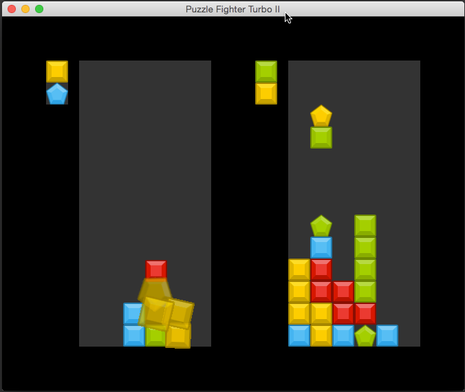

A puzzle fighter/swordfighting clone as an excuse for me to learn rust.

# Gameplay

A two player head-to-head game. Match falling blocks by color, then explode
them with special breaker blocks. This sends temporarily unbreakable blocks
over to your opponent. Chain combos for larger attacks! First one to run out of
space loses.

This is a mixed clone of [Super Puzzle Fighter II Turbo](https://en.wikipedia.org/wiki/Super_Puzzle_Fighter_II_Turbo) (aka _Puzzle Fighter_) and the [Swordfight mechanic](https://yppedia.puzzlepirates.com/Swordfight) from Puzzle Pirates.

# Features

* Two-player keyboard (WASDC, arrows+space) or gamepad controls.
* Sprinkle attacks with combo multiplier.

Play by cloning the repo and running:

    cargo run --release

See [issues](https://github.com/xaviershay/rust-puzzlefighter/issues) for major
remaining TODOs.

## Development

The block assets are auto-generated using imagemagick's `convert` tool.

    brew install imagemagick

    cargo run --example generate_tiles -- assets/src assets/gen

Some debug keys are enabled in non-release builds:

    Q:   Load blocks from board.txt
    1-4: Set next piece to a colored breaker
    5:   Drop an attack.

### Requirements

* [OpenGL 3](https://github.com/xaviershay/rust-puzzlefighter/issues/18#issuecomment-167256699)
